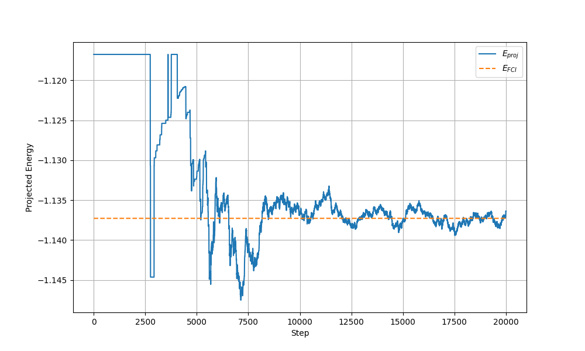
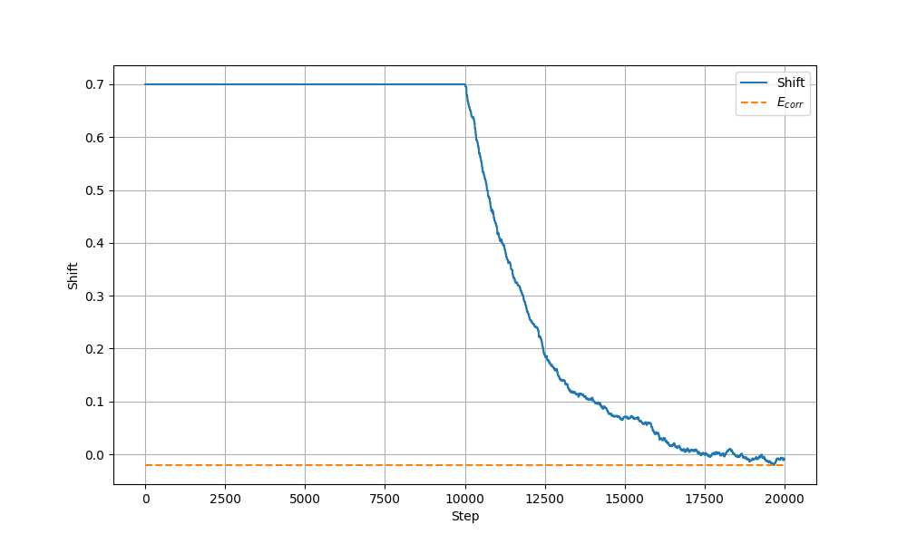
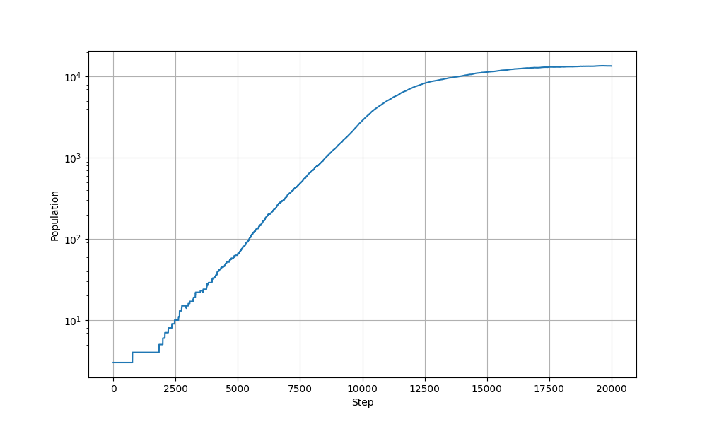
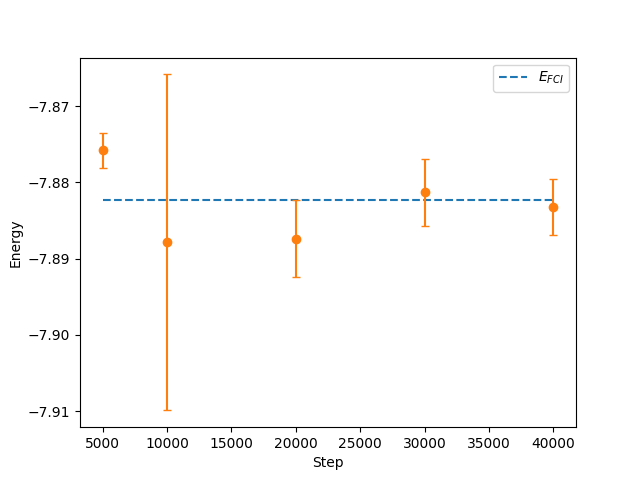
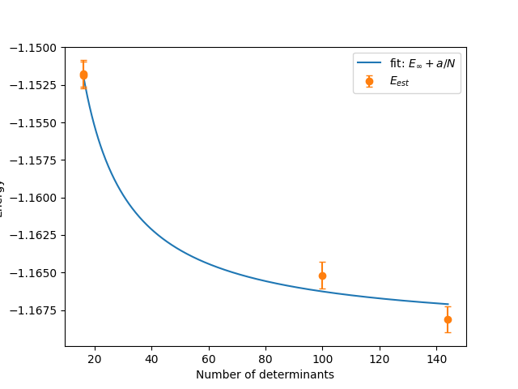

# Full Configuration Interaction Quantum Monte Carlo (FCIQMC)

In this repository, a Python implementation of the Full Configuration Interaction Quantum Monte Carlo (FCIQMC) method, originally proposed by Booth *et al.* in [*Fermion Monte Carlo without fixed nodes: A game of life, death, and annihilation in Slater determinant space*](https://pubs.aip.org/aip/jcp/article-abstract/131/5/054106/902018/Fermion-Monte-Carlo-without-fixed-nodes-A-game-of?redirectedFrom=fulltext) is provided. This code was developed as part of an undergraduate thesis at Internatinal Christian University.

## Usage

```
$ pip install pyscf matplotlib tqdm
``` 

Perform a FCIQMC simulation.

```
$ python main.py
```





Perform a extrapolation of the energy with respect to the number of steps.

```
$ python extrapolation_steps_vs_energy.py
```




Perform a extrapolation of the energy with respect to the number of determinants.

```
$ python extrapolation_det_vs_energy.py
```


